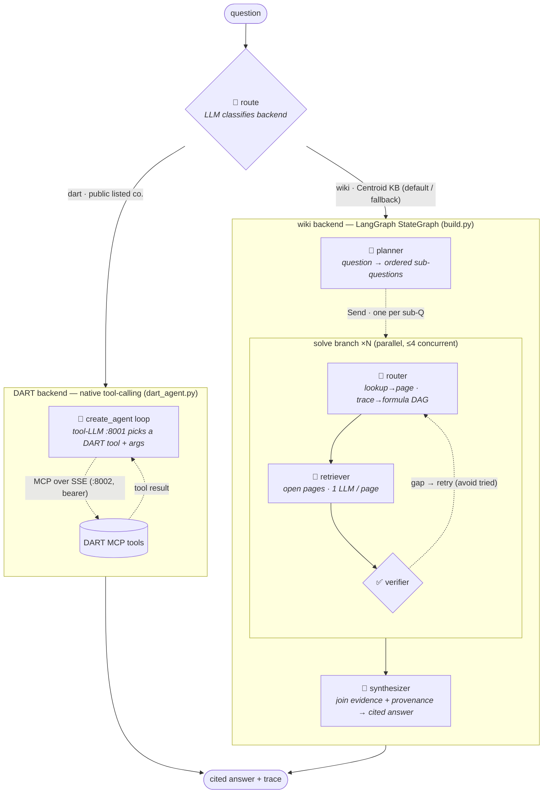
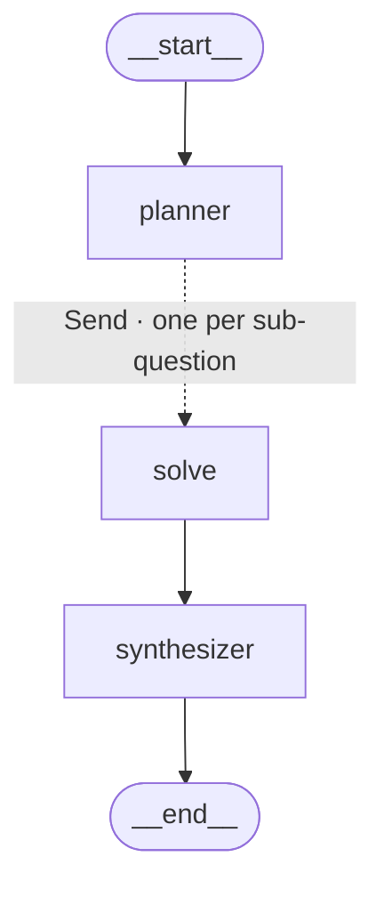
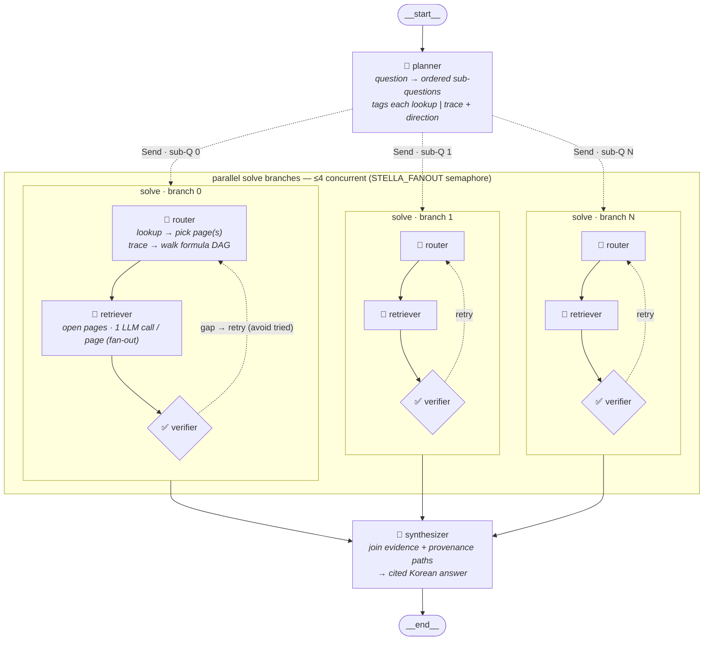

# Agent graph

The query agent (`apps/agent`) is **two backends behind one router**. `core.answer()`
first calls `core.route()` — an LLM classifier — to pick a backend, then dispatches:

- **wiki** (default) — the Centroid valuation KB. A LangGraph `StateGraph` compiled by
  `apps/agent/graph/build.py`: planner → fan-out `solve` (router→retriever→verifier) →
  synthesizer, over deterministic wiki reads.
- **dart** — public listed companies. A native tool-calling agent (`apps/agent/dart_agent.py`,
  LangChain `create_agent`) that calls the DART MCP server over SSE.

`get_graph()` only sees the *wiki* `StateGraph` — the `route` tier and the DART branch live
in `core.py`, outside the compiled graph — so the full architecture is drawn here, not by
LangGraph. Interactive view: open [`agent_graph.html`](agent_graph.html) in a browser
(drag nodes, Cytoscape.js).

## Full architecture

Everything `core.answer()` can do — both backends and the router that chooses between them.
This is the diagram the visualizer renders to PNG.

<!-- full-arch:begin -->

<!-- full-arch:end -->

Deterministic tools (no LLM) on the wiki side: `lookup` (term→page), `open_page`
(page→facts), `trace_links` (BFS over the formula DAG). The LLM only routes and writes prose.
On the DART side the model itself calls the tools — the gemma-4 container is served *with*
`--tool-call-parser gemma4`, unlike the guest vLLM the wiki agent uses.

## Wiki backend — compiled topology

What LangGraph actually compiles (`build_app().get_graph()`) — the `solve` step is a single
node that fans out via the `Send` API (dotted edge) and runs the router→retriever→verifier
loop internally.

## Wiki backend — expanded pipeline

What runs at query time. The planner splits the question; each sub-question becomes a
concurrent `solve` branch (≤4 in flight, semaphore-bounded); the synthesizer joins once all
branches have merged their evidence/paths/trace into the `operator.add` channels.

**Merge channels (reducers).** Branches never share working state — picked pages, retries,
and the per-page extraction stay local inside `solve_node`. They return only the
`operator.add` channels, which LangGraph concatenates/sums across the parallel barrier:

| channel | reducer | carries |
|---|---|---|
| `evidence` | `operator.add` | `[{page, cell, term, value, ask}]` from every page read |
| `paths`    | `operator.add` | provenance chains traced over the sheet-level formula DAG |
| `trace`    | `operator.add` | per-turn records (tagged with `sub`; renumbered in `core`) |
| `steps`    | `operator.add` | retriever reads consumed (total work) |

## DART backend — tool-calling loop

`dart_agent.run_dart()` builds a LangChain `create_agent` over the DART MCP tools (fetched
from the SSE server with a bearer token) and a tools-capable gemma-4 model. The model loops:
call a DART tool → read the result → call again or answer. Network/LLM failures degrade to an
error string in the answer rather than raising, so the router can always fall back to wiki.
Its message log is rendered into the **same** `{step, agent, action, arg, thought}` trace
shape the wiki agent emits, so the API/UI shows DART tool calls identically.
