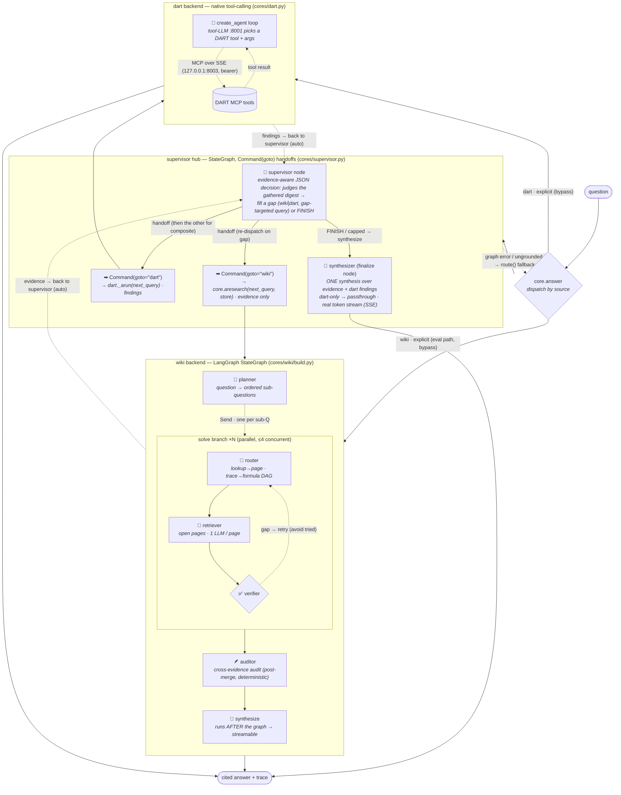
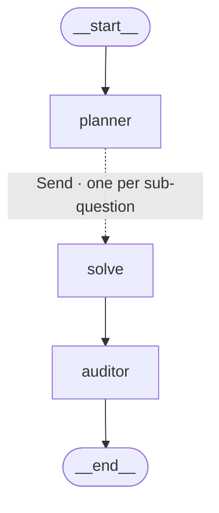
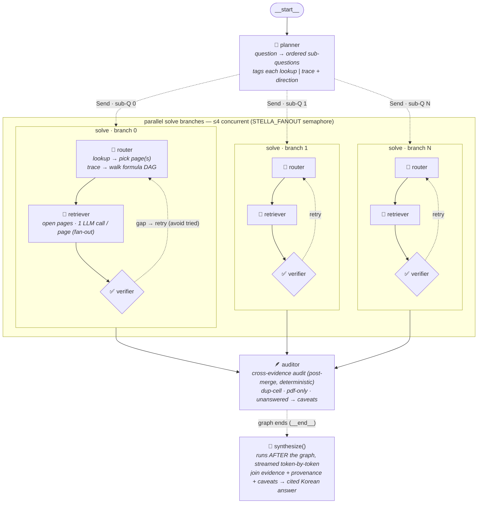

# Agent graph

The query agent (`apps/agent`) is a **supervisor-centric hub-and-spoke**: a central supervisor
that **decides each handoff** among cohesive specialist spokes — `wiki` (research), `dart`
(research), and `synthesizer` (the final answer). `core.answer(source)` dispatches by `source`:

- **`auto`** (default) — the **supervisor** (`apps/agent/cores/supervisor.py`): a LangGraph
  `StateGraph` whose `supervisor` node hands off to the `wiki`/`dart` **research** spokes via
  `Command(goto=…)`; each spoke returns its findings and hands control back, and the supervisor
  calls the other (or **both** for a composite cross-source question) before handing off to the
  **synthesizer** (`finalize` node). The supervisor *decides* with a plain JSON completion (stdlib
  `chat`, like `route()`), **not** tool-calling — it only chooses the next spoke / when to finish.
- **`wiki`** — straight to the Centroid KB LangGraph, **bypassing the supervisor** (the eval
  path is unchanged; this is the one place research+synthesis stay bundled).
- **`dart`** — straight to the DART tool-calling agent.

`core.route()` (the old LLM wiki-vs-dart classifier) is **kept only as the supervisor's
fallback** — used when the graph round fails or returns an ungrounded result, so a flaky
round never hard-fails or returns an ungrounded guess.

**The wiki spoke does research only.** It calls `core.aresearch` (planner→router→retriever→verifier,
fan-out preserved) and returns **cell-anchored evidence** — *not* a synthesized answer. The
**supervisor owns the answer** by handing off to the synthesizer, which composes **once** over the
combined wiki evidence + DART findings (no more double-synthesis on composite questions). A
**dart-only** answer is passed through **verbatim** (its tool-cited prose survives — not re-prosed).

**Streaming is real for every auto question.** `astream_supervised()` drives the supervisor graph
for the research/decision `step` events; when the supervisor hands off to the synthesizer it streams
the synthesizer's *real* `synthesize_stream` tokens (true time-to-first-token) **outside** the graph
— including composite questions (the old path replayed a buffered answer as fake chunks). Dart-only
prose is chunk-replayed (DART doesn't token-stream).

`get_graph()` only sees the *wiki* `StateGraph` — the supervisor tier and the DART branch live
in `core.py`/`cores/supervisor.py`, outside the compiled graph — so the full architecture is drawn
here, not by LangGraph. Rendered to [`agent_graph.png`](agent_graph.png) by
`scripts/visualize_graph.sh` (open it in your IDE); the mermaid below also renders on GitHub.

## Full architecture

Everything `core.answer()` can do — the supervisor, both backends, and the explicit-source
bypass. This is the diagram the visualizer renders to PNG.

<!-- full-arch:begin -->

<!-- full-arch:end -->

For the **auto** path each spoke's result returns to the supervisor node (dotted → `SA`), which
hands off again — to the other spoke for a composite question, or to the **synthesizer** to finish;
for an **explicit** `source` the backend answer goes straight to the output. Deterministic tools (no
LLM) on the wiki side: `lookup` (term→page), `open_page` (page→facts), `trace_links` (BFS over
the formula DAG). On the DART side the model itself calls the tools (the gemma-4 container is
served *with* `--tool-call-parser gemma4`); the **supervisor** itself needs no tool-calling — it
decides via a plain JSON handoff on the same stdlib `chat` the wiki retrieval uses.

## Supervisor — the hub StateGraph

`supervisor._build_supervisor(store)` compiles `START → supervisor → {wiki|dart} → … → finalize
→ END`. `arun_supervised()` drives it with `ainvoke`; `astream_supervised()` with
`astream(stream_mode="values")`, stopping before `finalize` to stream the synthesizer outside.

- **`supervisor` node (hub).** **Evidence-aware** decision: `_decide` is handed a **digest of what
  was actually gathered** (`_evidence_digest` — the facts + a gap view, not just which spokes ran)
  and judges *sufficiency*, returning `next ∈ {wiki, dart, FINISH}` + a **gap-targeted `query`** (it
  may re-dispatch the **same** spoke with a more specific query — a completeness gate, not one-shot).
  Returns `Command(goto=…)`. Loop-safety: a re-dispatch that adds **no new distinct evidence**
  (`_progress_count` deduped by page+cell → `stalled`) or the `_MAX_TURNS` cap forces a finish;
  **never finishes empty-handed** (a FINISH before any spoke ran grounds via the wiki). FINISH routes
  to `finalize` (the synthesizer).
- **`wiki` research spoke.** Runs `core.aresearch(next_query, store)` (planner→router→retriever→
  verifier, fan-out preserved) and returns **evidence** (+ `paths`/`caveats`), *not* an answer, then
  `Command(goto="supervisor")`. Closure over the per-request `WikiStore` (`store`) → dataset threads
  in concurrency-safely. Appends namespaced `wiki:*` trace + a `[supervisor] result` record.
- **`dart` research spoke.** Runs `dart._arun(next_query)` → prose `findings` (no cell evidence),
  then `Command(goto="supervisor")`. Namespaced `dart:*` trace.
- **`finalize` node (synthesizer spoke).** **Evidence present** (wiki-only or composite) → **one**
  synthesis via the wiki synthesizer over evidence + provenance + caveats + (any) dart findings.
  **dart-only** → passthrough DART's cited prose verbatim. **Nothing gathered** → `source="none"`
  (caller grounds via the wiki). Buffered reads this node's `answer`; streaming stops *before* it and
  streams `synthesize_stream` tokens for real.
- **Fallback.** Graph exception, or an empty/ungrounded result → `route()` + direct dispatch.
- **Result.** `{source, answer, trace, steps, evidence}`; `source` ∈ `wiki | dart | dart+wiki`. The
  trace interleaves `[supervisor] call/result` with the namespaced spoke steps, then
  `[synthesizer] answer` / `passthrough`, renumbered to a single sequential `step`; `steps` counts
  spoke dispatches.

## Wiki backend — compiled topology

What LangGraph actually compiles (`build_app().get_graph()`) — the `solve` step is a single
node that fans out via the `Send` API (dotted edge) and runs the router→retriever→verifier loop
internally. The graph **ends at the auditor**; `synthesize()` runs *after* the graph (in `core`)
so the final answer can be streamed token by token.

## Wiki backend — expanded pipeline

What runs at query time. The planner splits the question; each sub-question becomes a
concurrent `solve` branch (≤4 in flight, semaphore-bounded); the auditor runs once all branches
have merged their evidence/paths/trace into the `operator.add` channels; the synthesizer then
runs outside the graph.

**Merge channels (reducers).** Branches never share working state — picked pages, retries,
and the per-page extraction stay local inside `solve_node`. They return only the
`operator.add` channels, which LangGraph concatenates/sums across the parallel barrier; the
`auditor` reads the *merged* set the per-branch verifier never sees:

| channel | reducer | carries |
|---|---|---|
| `evidence` | `operator.add` | `[{page, cell, term, value, ask}]` from every page read |
| `paths`    | `operator.add` | provenance chains traced over the sheet-level formula DAG |
| `trace`    | `operator.add` | per-turn records (tagged with `sub`; renumbered in `core`) |
| `steps`    | `operator.add` | retriever reads consumed (total work) |

## DART backend — tool-calling loop

`dart._arun()` (sync wrapper `run_dart()`) builds a LangChain `create_agent` over the
DART MCP tools (fetched from the SSE server with a bearer token) and a tools-capable gemma-4
model. The model loops: call a DART tool → read the result → call again or answer. Network/LLM
failures degrade to an error string in the answer rather than raising, so the supervisor/router
can always fall back to wiki. Its message log is rendered into the **same** `{step, agent,
action, arg, thought}` trace shape the wiki agent emits, so the API/UI shows DART tool calls
identically — and the supervisor namespaces them `dart:*` when it invokes this backend as a tool.
