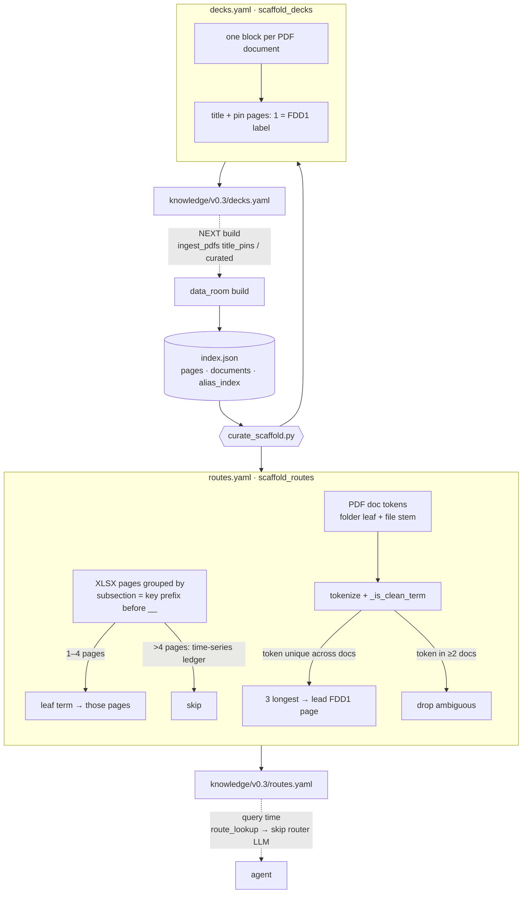

# Curation scaffolding (`decks.yaml` + `routes.yaml`)

For the **document-data-room** datasets (v0.3+), the two curation files are **auto-generated** from
a built wiki index by `src/stella_kb/wiki/curate_scaffold.py`, run as stage **[5]** of
`scripts/run_ingest_v03.sh` (after assemble, before lint). It is deterministic and offline (no LLM).
Both files are **overwritten every build**, so they stay in sync with the corpus.

This is distinct from the formula-model build (`run_pipeline.sh`, v0.1/v0.2), whose `decks.yaml`/
`routes.yaml` are **hand-authored**.

## Data flow



The two files are **mutually consistent by construction**: `decks.yaml` pins the exact `FDD1` page
names that `routes.yaml` targets, both read from the same post-build index.

## The shared gate — `_is_clean_term`

Every candidate route key passes one filter. It rejects: leading enumerators (`10.`, `가.`, `①`),
bare years / fiscal tokens (`2024`, `FY2023`), generic nouns in `_STOP` (`현황`, `회사`, `비율`…),
short pure-ASCII acronyms (`KDB`, `KB`, `NH`), and anything <2 / >40 chars or with no letters.
This is what keeps metric labels and boilerplate out of the routing table.

> **Safety invariant.** Routes are built from **structural identity** (subsection + document names),
> never from `alias_index` cell contents. The first attempt — "any unique clean alias → route" —
> produced **10,025 garbage routes**, because nearly every grid cell value is unique to its page.
> A metric like `지급여력비율` is *never* routed: it has no single clean alias (its row forms are
> `10. 지급여력비율`, filtered as enumerated) and lives in large time-series subsections (skipped),
> so a metric question always falls through to the alias lookup + LLM router.

## Worked example — how `금융상품` becomes a route

Document token: `1.6. 회계정책서 _ KDB생명_회계정책서_금융상품_개정_20221229`

1. **Split** on ` _ ` → folder `1.6. 회계정책서`, stem `KDB생명_회계정책서_금융상품_개정_20221229`.
2. **Folder leaf** (drop dotted number) → `회계정책서`.
3. **Tokenize** folder leaf + stem (split on `_ / · , & 및 와 과 ()` + whitespace) →
   `['회계정책서', 'KDB생명', '회계정책서', '금융상품', '개정', '20221229']`.
4. **Clean** (`_is_clean_term`) → drops `20221229` (bare number) → `['회계정책서', 'KDB생명', '회계정책서', '금융상품', '개정']`.
5. **Cross-doc uniqueness** (count docs each token appears in):
   - `회계정책서` → 16 docs → **dropped** (ambiguous)
   - `KDB생명` → 17 docs → **dropped**
   - `개정` → 3 docs → **dropped**
   - `금융상품` → **1 doc → kept**
6. **Cap** to the 3 longest unique tokens for this doc → `['금융상품']`.
7. **Emit** `금융상품 → [FDD1 page of this doc]`:
   ```yaml
   금융상품: FDD1 — [1.6. 회계정책서 _ KDB생명_회계정책서_금융상품_개정_20221229] KDB 생명 K-IFRS 기준 회계정책서 - 금융상품
   ```

At query time, a sub-question whose planner emits the hint term `금융상품` matches this key
(normalized on load), opens that page directly, and skips the router LLM
(`routes.yaml 직결 — 라우터 LLM 생략`). The companion `decks.yaml` block pins this doc's `FDD1`
label, so a future rebuild can't rename the page out from under the route.

## Where it plugs in

| File | Role | Read when |
|---|---|---|
| `src/stella_kb/wiki/curate_scaffold.py` | generator (`scaffold_routes` / `scaffold_decks` / `write_files`) | build stage [5] |
| `scripts/run_ingest_v03.sh` | runs the scaffolder after assemble | each v0.3 build |
| `src/stella_kb/wiki/data_room.py` (`ingest_pdfs`) | consumes `decks.yaml` (`pp._load_decks` → `title_pins`/`curated`) | **next** build |
| `apps/agent/retrieval/tools.py` (`route_lookup`) | consumes `routes.yaml` | query time |
| `tests/test_curate_scaffold.py` | deterministic offline coverage | `pytest` |
